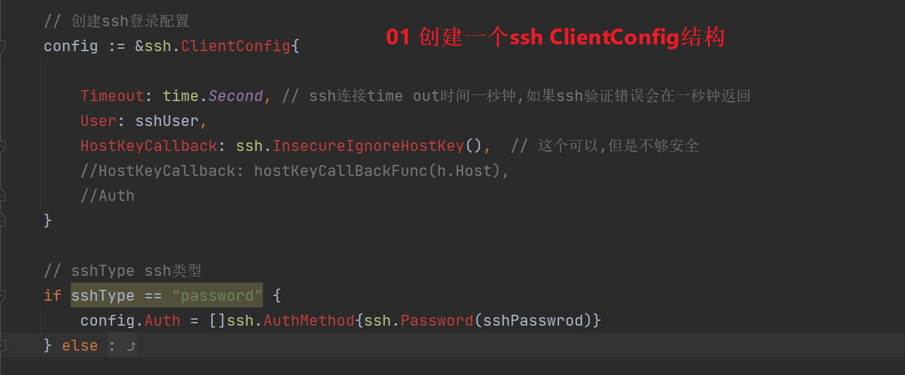
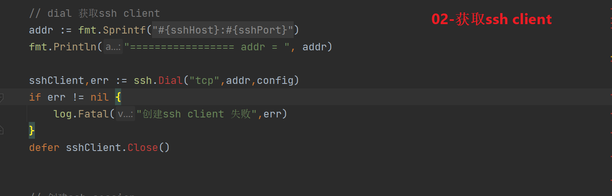
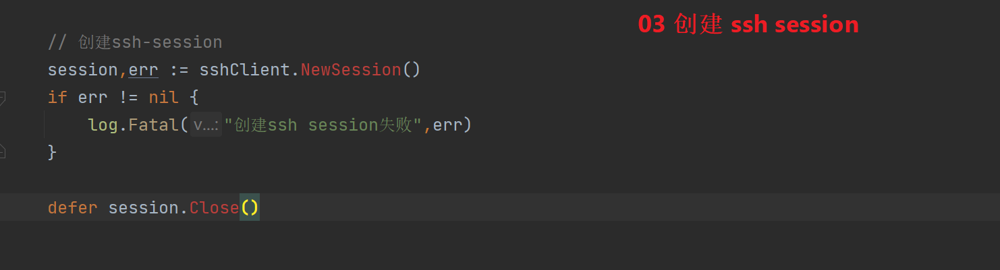
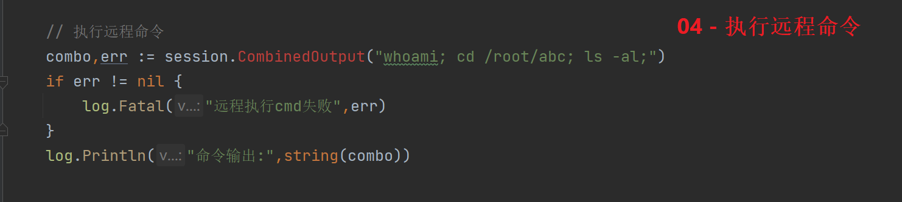

#  golang ssh intro 


https://xieys.club/webssh/


##  01 创建基本配置信息

```
	sshHost := "10.252.39.6"
	sshUser := "root"
	sshPasswrod := "root"
	sshType := "password"  // password或者key
	//sshKeyPath := "" // ssh id_rsa.id路径
	sshPort := 22
```




##   dial 获取ssh client



##  创建ssh-session



##  执行远程命令



